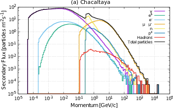
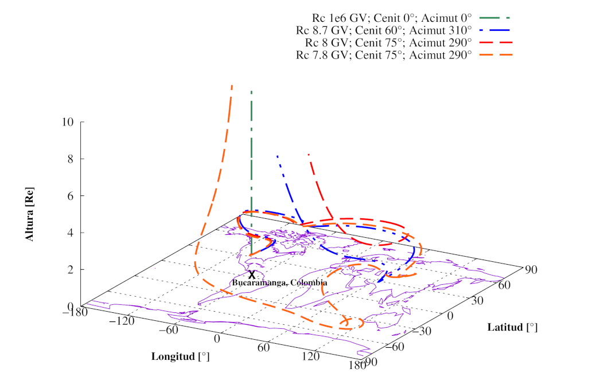
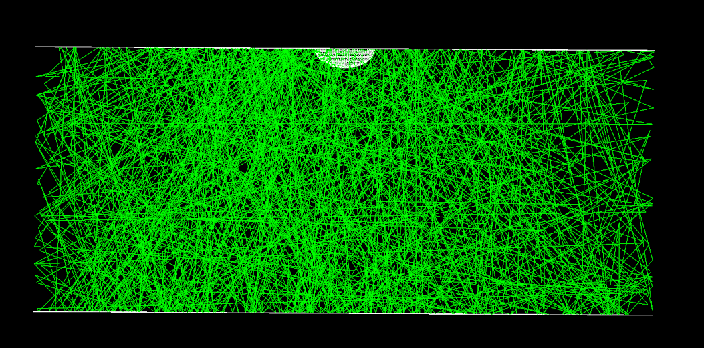

<div id="top"></div>
<br />
<div align="center">
  <a href="https://github.com/lagoproject/arti">
    
  </a>
  <h3 align="center">The ARTI Framework</h3>
  <p align="center">
    A framework designed to simulate the signals produced by the secondary particles emerging from the interaction of the flux of primary cosmic ray with the atmosphere. These signals are simulated for any particle detector located at any place (latitude, longitude and altitude), including the real-time atmospheric, geomagnetic and detector conditions.
    <br />
    <!-- <a href="https://github.com/lagoproject/arti"><strong>Explore the docs (soon) »</strong></a>
    <br /> -->
    <br />
    <!-- <a href="https://github.com/lagoproject/arti/issues">View Demo</a>  
    · -->
    <a href="https://github.com/lagoproject/arti/issues">Request Feature</a>
    ·
    <a href="https://github.com/lagoproject/arti/issues">Report Bug</a>
    ·
    <a href="#Contact">Contact us</a>
</p>
</div>

<!-- TABLE OF CONTENTS -->
<details>
  <summary>Table of Contents</summary>
  <ol>
    <li><a href="#about-arti">About ARTI</a></li>
    <li><a href="#getting-started">Getting Started</a></li>
    <li><a href="#usage">Usage</a></li>
    <li><a href="#related-projects">Related projects</a></li>
    <li><a href="#proposed-features">Proposed Features</a></li>
    <li><a href="#contributing">Contributing</a></li>
    <li><a href="#license">License</a></li>
    <li><a href="#contact">Contact</a></li>
  </ol>
</details>

<!-- ABOUT THE PROJECT -->
## About ARTI
<style>
html, body {height: 100%;}
img {
height: auto;
width: auto;
}
img.rel {
  width: 33%;
}
</style>



ARTI is a complete framework designed to simulate the signals produced by the secondary particles emerging from the interaction of singles, multiple and even the complete flux of primary cosmic rays with the atmosphere. These signals are simulated for any particle detector located at any place (latitude, longitude and altitude), including the real-time atmospheric, geomagnetic and detector conditions.

Formulated through a sequence of scripts coded in C++, Fortran, and Perl, it provides an easy-to-use integration of three different simulation environments: [Magneto Cosmics](http://cosray.unibe.ch/~laurent/magnetocosmics/), [CORSIKA](https://www.iap.kit.edu/corsika/) and [Geant4](https://geant4.web.cern.ch/). These tools evaluate the geomagnetic field effects on the primary flux, the atmospheric showers of cosmic rays and the detectors' response to the secondary flux of particles produced in the atmosphere.

With ARTI it is also possible to calculate the flux of the expected signals produced by the sudden occurrence of a gamma-ray bursts or the flux of energetic photons originating in steady gamma sources. It also compares these fluxes with the expected background to detect these phenomena in a single water Cherenkov detector (WCD).

Even more, by using ARTI, it is possible to calculate in a very precise way the expected flux of high energetic muons and other secondaries on the ground and to inject it over a geological structure for muography applications.

### ARTI main reference and citation

When using ARTI, please cite the reference reported below:

Christian Sarmiento-Cano, Mauricio Suárez-Durán, Rolando Calderón-Ardila, Adriana Vásquez-Ramírez, Andrei Jaimes-Motta, Luis A. Núñez, Sergio Dasso, Iván Sidelnik and Asorey (for the LAGO Collaboration), _"The ARTI Framework: Cosmic Rays Atmospheric Background Simulations"_, _European Journal of Physics_ **C**, submitted, [arXiv:2010.14591[astro-ph.IM]](https://arxiv.org/abs/2010.14591), [doi:10.48550/arXiv.2010.14591](https://doi.org/10.48550/arXiv.2010.14591) (2022).
[(bibtex)](docs/references/arti.bib)

<p align="right">(<a href="#top">back to top</a>)</p>

<!-- GETTING STARTED -->
## Getting Started

To get a local copy up and running follow these simple example steps.

### Prerequisites

#### System requirements

ARTI runs in any Linux based system, including iOS. For Windows user, we strongly recommend to install some of your preferred linux distribution using virtualbox. Additionally, we are developing a docker-based ARTI implementation. 

In Fedora, Scientific Linux and CentOS, use `sudo yum install <package>`. In Ubuntu/Debian,  use `sudo apt install <package>. In both cases, you can also use the graphic package manager included in your preferred distro. 

ARTI requires the installation of the following packages: 

* bash
* perl 5.0 
* gcc
* make
* screen
* rsync
* git

As a one-liner for Ubuntu/Debian:

```bash 
sudo apt install build-essential screen rsync git
```
(git is optional).

#### Dependencies

Additionally, ARTI depends on the previous installation of the following frameworks:

* [CORSIKA v7.7402](https://www.iap.kit.edu/corsika/79.php).
* [ROOT v6.20.08](https://root.cern/releases/release-60802/).
* [Magneto Cosmics v2.0](http://cosray.unibe.ch/~laurent/magnetocosmics/).
* [Geant v4.10.03.p03](https://geant4.web.cern.ch/support/download_archive?page=4)
* [Geant v4.10.03 Data Libraries](https://geant4.web.cern.ch/support/download_archive?page=4)

CORSIKA should be compiled with the following options: 
```
Compiler: 64bits 
High Energy Hadronic Model: QGSJETII-04
Low Energy hadronic interaction model: GHEISHA 2002d
Detector Geometry: non-flat (Volume) detector
```
and, for production, the following additional program options:
```
Landau-Pomeranchunk-Migdal (LPM) effect
Curved atmosphere version
external atmosphere functions
EFIELD
```
Additionally, ARTI is compatible with some other CORSIKA functionalities, such as ```PLOTSH```, ```PLOTSH2```. and ```CHERENKOV```, but it is not recommended to compile CORSIKA using these options as they will strongly decrease the simulation performance and are not needed for production. 
A pre-compiled version of CORSIKA intended for simulation production is available [upon request](#Contact).

There are no other special requirements for ROOT, MAGNETOCOSMICS and GEANT4. Standard installations of these packages will smoothly work with ARTI. 

### Installation

1. If you are using git, just clone this repository:
   ```bash
   cd /path/to/ARTI/installation
   git clone https://github.com/lagoproject/arti.git
   ```
   Otherwise, you can also directly download ARTI without using git (in this case, you should reinstall ARTI for every upgrade):
   ```bash
   cd /path/to/ARTI/installation
   wget -c https://github.com/lagoproject/arti/archive/refs/heads/master.zip
   unzip master.zip
   rm master.zip
   ```
2. ARTI compiling is very simple:
   ```bash
   cd arti
   make
   ```
   1. During the first installation of ARTI (or if you need to install ARTI in a different directory), `make` will define the `$ARTI` environment variable, that points to the ARTI current directory installation. Then, ARTI installer will add the definition of this variable to the user's local `.bashrc` and to the local `$PATH` environment variable:
      ```bash
      #
      ## Changes added by the ARTI suite on <installation date>
      #
      export ARTI="/path/to/ARTI/installation/arti"
      export PATH="${ARTI}/sims/:${ARTI}/analysis:$PATH"
      ```
      You can edit your `.bashrc` to add, e.g., the directory where the CORSIKA executables files were located, for example:
      ```bash
      export CRK="/path/to/CORSIKA/run"
      export PATH="${CRK}/:$PATH"

If you follow the above described steps and everything works well, you should find some new executable files at the `${ARTI}/analysis` directory.

### Pre-compiled ARTI framework (inc. dependencies)

A Docker container having all the ARTI requirements and dependencies installed and configured with the corresponding options for production is currently under development and will be available in June 2022.

If you want to receive information about the ARTI new releases, or have any doubts or require extra information about the compiling options for all these packages, please don't hesitate to [contact us](#Contact). 

<p align="right">(<a href="#top">back to top</a>)</p>

### ARTI updates, releases, branchs and tags

ARTI is continously used, revised and updated within the [LAGO Collaboration](https://lagoproject.net). 

Unless you are a developer, we recommend to use only the latest ARTI release contained in the `master` branch of this repository. Stable versions are tagged and can be found in the [corresponding section of this repository](https://github.com/lagoproject/arti/tags).

Clone and install ARTI from `dev` or `dev-*` branches is strongly discouraged, as these branches are used for testing, bug correction and for the development of new features.

If you are using `git`, you can update ARTI just by doing: 

```bash
cd /path/to/ARTI/installation/arti
git pull
make
```

Otherwise, you could just reinstall ARTI by following the [installation guide](#installation).

<p align="right">(<a href="#top">back to top</a>)</p>

## Usage

The ARTI approach for calculation the expected flux of signals due to the integrated flux of cosmic rays is based on three stages:

1. Definition of the site characteristics, primary spectrum calculations and [Extensive Air Showers (EAS](https://en.wikipedia.org/wiki/Air_shower_(physics))) developments;
2. Analysis of the secondary particles at ground and geomagnetic corrections; 
3. Detector simulation.

Depending on the type of calculation the user should need, there are different pathways that need to be followed. 

### Flux calculation basis

#### a. Expected flux of secondaries at ground level

The flux simulation background starts with the `do_sims.sh` script, as follows:

```bash
do_sims.sh -w path_to/corsika/run/ -p fluxBGA -s bga -v 77402 -t 3600 -u orcid -y -x
```
With this options, ARTI will integrate the expected flux of primaries during 3600 second (`-t 3600`) for the city of Bucaramanga, Colombia (`-s bga`) at an altitude of 965 m a.s.l., using a volumetric WCD (`-y`). EAS calculations will be done using the CORSIKA executables version 7.7402 (`-v 77402`) located at `-w path_to/corsika/run`. The user [ORCID](https://orcid.org/) (-u `orcid`) will be stored in the corresponding metadata and will be preserved for future citation of the data. While it is recommended to use your ORCID, any alphanumeric string is accepted. For the rest of possible options, do_sims.sh will use the ARTI defaults (`- x`). Otherwise, they would be answered in an interactive ARTI session.

The list of predefined sites in ARTI is compiled and regularly updated in [the LAGO Data Management Plan](https://lagoproject.github.io/DMP/defs/sitesLago/). ARTI includes a JSON parser to get the characteristics needed for the simulation of the flux at several predefined sites.

Defaults, included the site characteristics, can be overridden by the user by selecting the corresponding options. Please run 
```bash 
do_sims.sh -?
``` 
to view a brief description of the available options.
The resulting files will be stored at the local directory `/path_to/corsika/run/fluxBGA`, automatically created from the path given with the `-w` option and the project name (`-p fluxBGA`).

The scripts and codes related with these calculations can be found in the [sims](sims) directory. All of them have their own integrated help, accessible through the `-?` modifier.

#### b. Analysis of the secondaries and geomagnetic effects

Once the catalogues with the raw data of the flux are produced, they can be read and analysed with the ARTI analyses tools to extract the secondary particle flux information: the secondary particle ID, the particle momentum, the particle position relative to the primary core, and additional information related with its primary progenitor.
Depending on the environment, the analysis stage can be performed automatically during the runtime or manually by calling to the `do_showers.sh` script:

```bash
$ do_showers.sh -o /path_to/corsika/run/fluxBGA -k 965 -t 3600 -g bga.geo 3 -l
```
With this options, ARTI will perform the standard analysis of the files located at `/path_to/corsika/run/fluxBGA` (`-o` option), corresponding to the flux of secondaries impinging 1 m2 at ground during 3600s (`-t` option) for a site at an altitude of 965 m a.s.l. (`-k` option), using the column 3 of the geomagnetic conditions file `bga.geo` (`-g` option). The analysis will be parallelized (`-l`) using the default number of processors equals to half the available ones, and the results will be stored in the current directory (default: `$PWD`, see option `-w`). 

As in the previous case, all the codes and executables have their internal help (`-?`) and are available in the [analysis](analysis) directory.

#### c. Water Cherenkov Detector Simulation

A complete and detailed simulation of a generic and modifiable WCD Geant4 simulation is included in the [wcd](wcd) directory. 

The main characteristics of the detector can be easily configured by editing the corresponding files in the [src](wcd/src), such as: the water container material, thickness and geometry; the reflectivity and diffusivity of the detector's inner coating; the water absorption curves in the optical and UV wavelength range; the geometry and wavelength sensitivity of the photomultiplier tube (PMT); and the emulated response of the onboard electronic system.

Once the corresponding variables are updated in the code, it must be re-compiled by doing:
```bash
cmake -DGeant4_DIR=/path/to/geant4/lib/Geant4-version/
make -j2
```
and a new `wcd` executable file will be compiled at the `wcd` directory. 
Before to run, the file containing the secondaries at ground resulting of the previous analisys should be defined in the `input.in` file.

Again, depending on the environment, it could run automatically during runtime or has to be called by the user once the previous stages are completed, by doing:
```bash
wcd -m input.in
```

### General help and documentation

The documentation is currently under preparation and will be released in July 2022. A brief description of the action of each code and the available options and modifiers can be seen by calling them with the `-? modifier`.

_For more examples, please refer to the [ARTI Documentation](docs)._

<p align="right">(<a href="#top">back to top</a>)</p>

## Related projects

ARTI has several options and internal configurations to automatically run at different types of computing facilities: from personal notebooks or desktops up to high performance computing clusters. 

More recently, [oneDataSim](https://github.com/lagoproject/onedataSim), a cloud-based implementation of ARTI, has been developed under the [LAGO Thematic Service](https://www.eosc-synergy.eu/supporting-astrophysics/) at the [_European Open Science Cloud - Expanding Capacities by building Capabilities_](https://www.eosc-synergy.eu/) project.

By using [oneDataSim](https://github.com/lagoproject/onedataSim), currently available through the [EOSC Marketplace](https://marketplace.eosc-portal.eu/services/onedatasim), it is possible to run the ARTI simulations at federated clouds, such as the [European Open Scientific Cloud (EOSC](https://eosc-portal.eu/)) and other public clouds, such as the [Google cloud](https://cloud.google.com/),[ Amazon web services](https://aws.amazon.com/) and [Microsoft Azure](https://azure.microsoft.com/).

<p align="right">(<a href="#top">back to top</a>)</p>

## Proposed features

See the [open issues](https://github.com/lagoproject/arti/issues) for a full list of proposed features (and known issues).

<p align="right">(<a href="#top">back to top</a>)</p>

<!-- CONTRIBUTING -->
## Contributing

Contributions are what make the open source community such an amazing place to learn, inspire, and create. Any contributions you make are **greatly appreciated**.

If you have a suggestion that would make this better, please fork the repo and create a pull request. You can also simply open an issue with the tag "enhancement".
Don't forget to give the project a star! Thanks again!

1. Fork the Project
2. Create your Feature Branch (`git checkout -b feature/AmazingFeature`)
3. Commit your Changes (`git commit -m 'Add some AmazingFeature'`)
4. Push to the Branch (`git push origin feature/AmazingFeature`)
5. Open a Pull Request

<p align="right">(<a href="#top">back to top</a>)</p>

<!-- LICENSE -->
## License

ARTI is distributed under the [BSD-3 License](https://opensource.org/licenses/BSD-3-Clause). See the [LICENCE](LICENSE) for more information.

<p align="right">(<a href="#top">back to top</a>)</p>

<!-- CONTACT -->
## Contact

The ARTI framework is developed by the LAGO simulation group. If you need to contact us, please complete our [contact form](https://lagoproject.net/contact.html). 

ARTI main contributor: [Dr. Hernán Asorey (@asoreyh)](https://github.com/asoreyh)

Project Link: [https://github.com/lagoproject/arti](https://github.com/lagoproject/arti)

<p align="right">(<a href="#top">back to top</a>)</p>